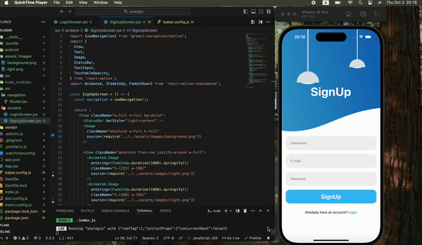

# Project Name: Animated Login Page with React Native

This project is an animated login page application built using React Native. It features a user-friendly interface with animated transitions and modern design components. Users can easily switch between the "Sign Up" and "Login" screens. The project utilizes the react-native-reanimated library to implement smooth animations.

# Features

Animations: Fade-in and fade-out animations (FadeInUp, FadeInDown) for enhancing user interactions.
Modern UI: Sleek, user-friendly interface design.
Responsive Design: Optimized for mobile devices.
High Performance: Fast and smooth user experience powered by React Native's performance enhancements.

# Technologies Used

React Native: Framework for mobile app development.
react-native-reanimated: Used for implementing animations.
React Navigation: For navigation between screens.
JavaScript / JSX: Core languages used in the project development.

# Preview

# SignUp-Page-ReactNative
# SignUp-Page-ReactNative
